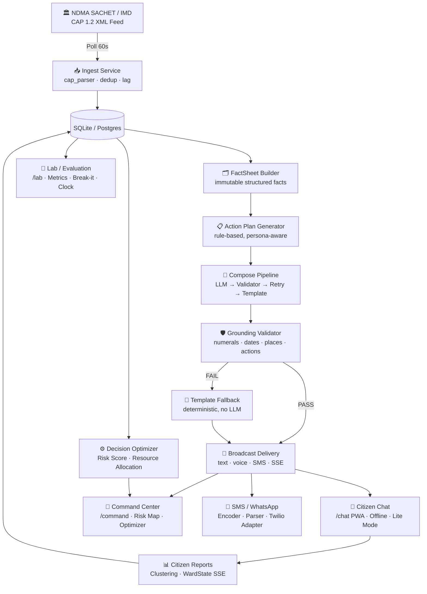
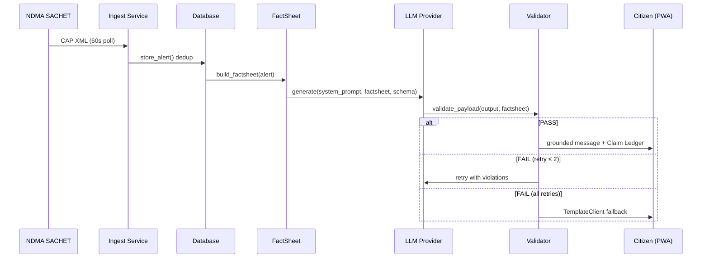

# SkySafe AI 🌩️ — Shielding Communities with Action Intelligence

> **SIH 2026 · Problem SIH26068** — *WeatherGPT: Conversational AI for Weather Forecasting, Alerts and Climate Information (Disaster Management Theme)*

**SkySafe AI** turns official government weather warnings (NDMA SACHET / IMD, CAP format) into simple, life-saving, multilingual voice/SMS actions for citizens, and gives officials a live decision dashboard with prioritised resource allocation.

---

## ⚡ 3-Command Quick Start

```bash
cp .env.example .env         # 1. Copy environment config (edit API keys only if needed)
make up                      # 2. Start backend + frontend (docker compose)
make demo                    # 3. Reset demo data and launch the 5-minute scenario
```

**No API keys required for demo mode.** All 308 tests pass with `LLM_PROVIDER=null`.

Access:
- Citizen Chat: http://localhost:3000/chat
- Command Center: http://localhost:3000/command
- Lab & Evaluation: http://localhost:3000/lab
- Backend API Docs: http://localhost:8000/docs

---

## 🏗️ Architecture



---

## 🔄 Data Flow



---

## 🛡️ How Zero-Hallucination Works

Every factual number, date, place name, and severity word visible to the citizen or official is **traceable to an official source**.

### Pipeline

1. **FactSheet** — built deterministically from the raw CAP alert. Every fact gets a stable ID (`F1`, `F2`, …).
2. **ActionPlan** — curated do/don't library, selected by rule (no LLM). Every action gets a stable ID (`a1`, `a2`, …).
3. **LLM Rewording** — LLM may only (a) select facts by ID, (b) select actions by ID, (c) rephrase in plain language. It cannot invent new facts.
4. **Grounding Validator** — checks every numeral, date/time, place, and severity word in LLM output against the FactSheet. Any mismatch → FAIL.
5. **Retry** — validator returns the violation list; LLM is given one more chance.
6. **Template Fallback** — if still FAIL, `TemplateClient` (no LLM) assembles the message deterministically. Always safe.

### Claim Ledger Example

```json
{
  "status": "PASS",
  "alert_id": "SACHET-2026-CYC-001",
  "claims": [
    { "id": "F1", "field": "event",      "value": "Cyclone",  "source": "SACHET CAP", "verified": true },
    { "id": "F2", "field": "wind_speed", "value": "120 kmh",  "source": "SACHET CAP", "verified": true },
    { "id": "F3", "field": "onset",      "value": "14:30 IST","source": "SACHET CAP", "verified": true }
  ],
  "global_reason": "All claims verified against FactSheet."
}
```

Every bubble the citizen sees has a ✅ badge that opens this ledger.

---

## 🌐 Environment Variables

| Variable | Required | Default | Description |
|----------|----------|---------|-------------|
| `DATABASE_URL` | No | `sqlite:///./app_test.db` | DB connection string |
| `MODE` | No | `fixtures` | `live` or `fixtures` |
| `LLM_PROVIDER` | No | `null` | `null` \| `gemini` \| `ollama` \| `groq` |
| `GEMINI_API_KEY` | No | — | Only if `LLM_PROVIDER=gemini` |
| `OLLAMA_URL` | No | `http://localhost:11434` | Only if `LLM_PROVIDER=ollama` |
| `ALLOWED_ORIGINS` | No | `http://localhost:3000,http://localhost:3001` | CORS allowed origins |
| `TWILIO_ENABLED` | No | `false` | Enable real Twilio SMS/WhatsApp |
| `TWILIO_ACCOUNT_SID` | No | — | Only if `TWILIO_ENABLED=true` |
| `TWILIO_AUTH_TOKEN` | No | — | Only if `TWILIO_ENABLED=true` |
| `DEMO_DISTRICT` | No | `Cuttack` | Default district for demo |
| `INGEST_POLL_INTERVAL_SECONDS` | No | `60` | Feed polling frequency |

---

## ✅ What Is Real vs. Simulated

| Feature | Status | Notes |
|---------|--------|-------|
| NDMA SACHET RSS Feed | **Real** in live mode, **fixtures** in demo | CAP 1.2 XML from `sachet.ndma.gov.in` |
| IMD RSS Feed | **Real** in live mode | `mausam.imd.gov.in` |
| Alert parsing | **Real** | Deterministic CAP 1.2 parser |
| Grounding Validator | **Real** | Runs on every LLM response |
| LLM responses | **Real** if API key set, **template fallback** otherwise | `LLM_PROVIDER=null` for demo |
| Voice notes (TTS) | **Simulated** (text fallback) unless Sarvam/gTTS configured | `audio_url=null` in demo |
| SMS delivery | **Simulated** unless `TWILIO_ENABLED=true` | Logged to console |
| WhatsApp | **Simulated** | Requires approved Twilio template in production |
| Citizen reports | **Simulated** via `/api/reports/simulate` in demo | Real pipeline, simulated data |
| Resource optimizer | **Real** computation (greedy + haversine) | Seeded depot/resource data |
| Weather history / Climate | **Real** | Open-Meteo API (free, no key needed) |

---

## 🧪 Testing

```bash
# Backend tests (279+ tests, no API key required)
make test
# or
python -m pytest backend/tests/ -q

# Frontend lint + type-check
cd frontend && npx tsc --noEmit && npx next lint

# Full demo reset + run
make demo
```

---

## 📚 Documentation

| Doc | Purpose |
|-----|---------|
| [`docs/SECURITY.md`](docs/SECURITY.md) | OWASP API Top 10 checklist |
| [`docs/RESILIENCE.md`](docs/RESILIENCE.md) | Degradation path runbook |
| [`docs/DEMO.md`](docs/DEMO.md) | 5-minute scripted demo |
| [`docs/QA_REPORT.md`](docs/QA_REPORT.md) | Full QA results |
| [`docs/DECISIONS.md`](docs/DECISIONS.md) | Architecture decisions |
| [`docs/PROGRESS.md`](docs/PROGRESS.md) | Build progress log |
